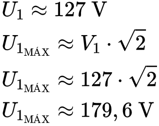

# **Fonte de Tensão**
Trabalho solicitado pelo professor Eduardo do Vale Simões como critério parcial de avaliação da disciplina de Eletrônica para Computação, do 1º período de 2022, do curso de Ciências de Computação do Instituto de Ciências Matemáticas e de Computação (ICMC), da Universidade de São Paulo (USP).
## **Projeto**
Uma fonte de tensão que recebe, em sua entrada, corrente alternada e tensão de 127V ou 220V, e converte em corrente contínua e tensão, entre os terminais da saída, ajustável em um intervalo de 3V a 12V.
## **Lista de Materiais**
| Material        | Modelo |Descrição|Quantidade           | Preço  |
| ------------- |:-------------:| -----:| -----:| -----:|
|Transformador*|-|12 V + 12 V|1|R$ 0,00|
|Diodo|1N4007|Silício|4|R$ 0,80|
|Capacitor|470UFX25V|470 µF|1|R$ 1,05|
|LED|333-2SDRD/S530-A3-L|Vermelho|1|R$ 0,50|
|Resistor|1K|1 kΩ|7|R$ 0,49|
|Diodo Zener|1N4743|13 V|1|R$ 0,48|
|Potenciômetro|B10K|10 kΩ|1|R$ 7|
|Transistor|BC337-40|NPN|1|R$ 0,69|
|*Protoboard**|-|830 Pontos|1|R$ 0,00|
|**Total**||||**R$ 11,01**|

*O componente elétrico foi emprestado pelo professor da disciplina.

## **Componentes Elétricos**
### **Transformador**
    
O transformador reduz a tensão elétrica da entrada, a tomada, em nosso caso, sob a proporção de aproximadamente, 1 : 7,5, a razão entre o número de voltas dos enrolamentos primário e secundário. Assim, entre os seus terminais de saída, a tensão gira em torno de 22 V.

### **Ponte de Diodo**

A ponte de diodo, construída através da junção de quatro diodos, complementa o papel do transformador, convertendo corrente alternada em contínua e, por conseguinte, os ciclos da senóide proveniente da tomada, em positivos e, assim, úteis à alimentação do circuito.

### **Capacitor**

O capacitor, por sua vez, armazena carga elétrica e produz corrente quando a tensão no circuito se torna inferior à tensão entre as suas armaduras e, assim, ele abaixa o valor de *ripple* no circuito (cerca de 10% em nosso projeto).

### **LED**

É um elemento opcional, sendo o seu papel, apenas, de um sinalizar o funcionamento do circuito.

### **Resistor**

Em síntese, os resistores promovem a diminuição do fluxo de corrente elétrica nos ramos do circuito, evitando a sobrecarga dos componentes, como é o caso do LED, por exemplo.

### **Diodo Zener**

O diodo zener somente conduz eletricidade quando a tensão entre os seus terminais estiver acima da sua tensão de trabalho (13 V), o que viabiliza a entrega, na saída, de uma tensão máxima aproximada de 12,2 V.

### **Potenciômetro**

O potênciometro nos permite o controle da diferença de potencial elétrico entre os terminais de saída da fonte, pois ele consiste em um resistor de resistência ajustável.

### **Transistor**

O componente em questão exerce o controle da passagem de corrente elétrica.

### ***Protoboard***

A protoboard foi o suporte por nós utilizado para estabelecer a ligação entre os componentes elétricos do circuito.

## **Circuito Elétrico**
https://www.youtube.com/watch?v=KPHPES0NaVc

  
  
  

## **Diagrama Esquemático**

### **Falstad**
.png)

https://tinyurl.com/27zkp3qr
### **EAGLE**
.png)
## **Placa de Circuito de Impresso (PCB)**
.png)
### **Parte Superior**
%20(Parte%20Superior).2.png)
### **Parte Inferior**
%20(Parte%20Inferior).2.png)
### **Furação**
%20(Furação).2.png)
## **Cálculos**
### **Tensão Elétrica**

  
  
  
  

* A tensão eficaz (RMS) na fonte de corrente alternada (tomada) é de 127 V;
* U1: tensão elétrica no enrolamento primário do transformador;
* U2: tensão elétrica no enrolamento secundário do transformador;
* U3: tensão elétrica na saída da ponte de diodo;
* N1: número de voltas no enrolamento primário do transformador;
* N2: número de voltas no enrolamento secundário do transformador;
* O diodo é de silício e, portanto, a tensão elétrica em seus terminais é de, aproximadamente, 0,7 V;

### **Corrente Elétrica**

  
  
  
  

* R1: resistência elétrica do resistor associado em série com o LED;
* R2: resistência elétrica da carga associado em série com o diodo zener;
* R3: resistência elétrica da carga;
* Ube: tensão elétrica entre a base e o emissor do transistor;
* A tensão elétrica no LED é de cerca de 2 V.

### **Capacitância**

* A frequência é de 120 Hz, o dobro da tomada, pois a nossa fonte de tensão conta com um retificador de onda completa;
* O grupo fez uso de um capacitor de 470 µF, o primeiro valor comercial acima da capacitância mínima para um valor de *ripple* de 10%;
* Urpp: tensão de *ripple*.

## **Vídeo**
(Link)
## **Grupo**
* Kayky Pimentel de Sena;
* Miller Matheus Lima Anacleto Rocha;
* Gabriela Amadori;
* Murilo Fonseca de Matos.
