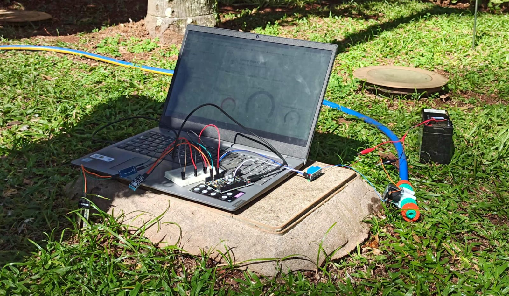
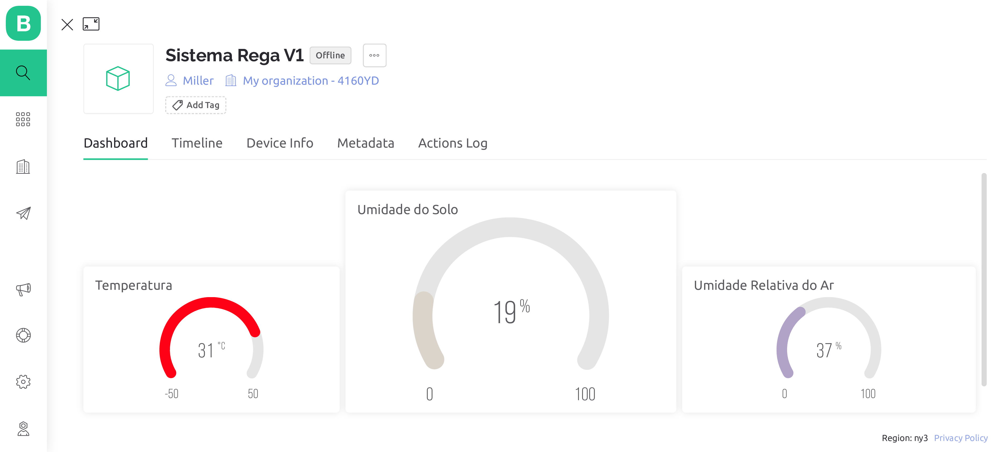

# **Sistema de Rega Inteligente**

Trabalho solicitado pelo professor Eduardo do Vale Simões como critério parcial de avaliação da disciplina de Eletrônica para Computação, do 1º período de 2022, do curso de Ciências de Computação do Instituto de Ciências Matemáticas e de Computação (ICMC), da Universidade de São Paulo (USP).

## **Projeto**

Um sistema automático de rega baseado no nível de umidade do solo, assim como um site e um aplicativo contendo informações extraídas por sensores: umidade relativa do ar, umidade do solo e temperatura ambiente.

## **Lista de Materiais**
|Material|Modelo|Descrição|Quantidade|Preço|
|:-------------|:-------------:|:-----:|:-----|:-----|
|Microcontrolador|UNO R3 + ESP8266|-|1|R$ 119,90|
|Módulo Sensor de Temperatura e Umidade do Ar|DHT11|Digital|1|R$ 20,90|
|Módulo Sensor de Umidade do Solo|-|Analógico|1|R$ 9,99|
|Módulo Relé|-|1 Canal, 5 V|1|R$ 9,99|
|Jumper Macho x Macho*|-|-|2|R$ 0,60|
|Jumper Macho x Fêmea*|-|-|8|R$ 2,40|
|Válvula Solenóide|-|1/2", 12 V, 180º|1|R$ 54,90|
|Engate Rosqueado|-|1/2"|2|R$ 15,00|
|Mangueira**|-|1/2"|1|R$ 0,00|
|*Protoboard*|-|400 Pontos|1|R$ 14,99|
|**Total**||||**R$ 248,67**|

*A quantidade de *jumpers* vai variar de acordo com a construção do circuito.

**O custo da mangueira foi zero, pois o grupo reaproveitou uma mangueira do jardim do Instituto de Ciências Matemáticas e de Computação (ICMC).

  <iframe width="560" height="315" src="https://www.youtube.com/embed/MQpC46KNnUE" title="YouTube video player" frameborder="0" allow="accelerometer; autoplay;    clipboard-write; encrypted-media; gyroscope; picture-in-picture" allowfullscreen></iframe>

  

## **Diagrama Esquemático**

## **Grupo**
* Kayky Pimentel de Sena;
* Miller Matheus Lima Anacleto Rocha;
* Gabriela Amadori;
* Murilo Fonseca de Matos.
